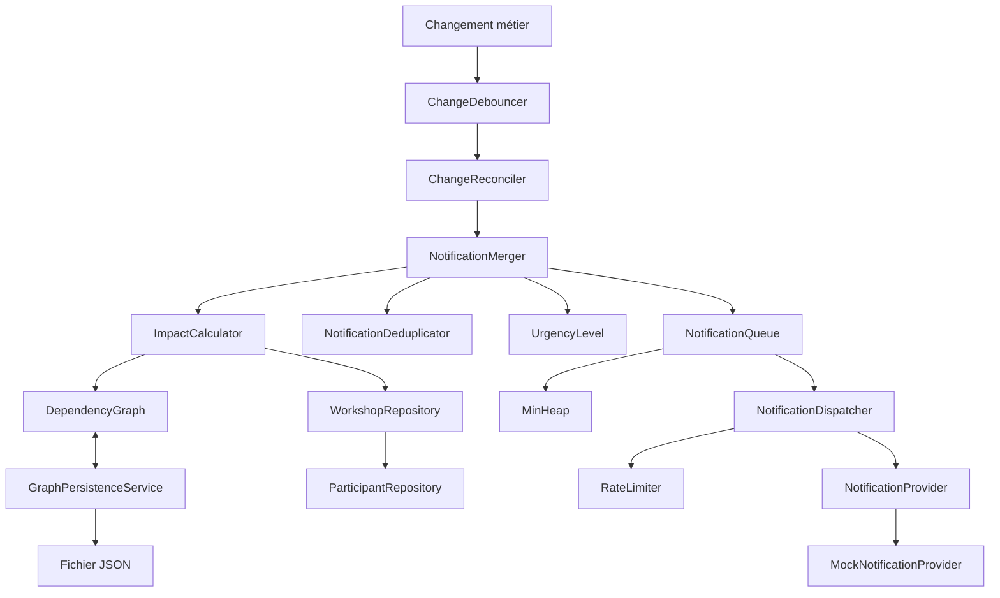

# EpiSimulated — Propagation d'impact et notifications optimisées

## 1. Présentation

Ce projet implémente le cœur métier d'un système capable de **calculer la propagation d'un changement entre des ateliers dépendants**, d'identifier les participants réellement concernés, puis de **regrouper, dédupliquer, prioriser et limiter l'envoi des notifications**.

L'objectif principal est d'éviter les notifications inutiles tout en conservant une propagation correcte des changements.

> **État actuel du projet :** le dépôt contient le cœur métier TypeScript et ses tests. Il n'y a pas encore d'API HTTP, d'application mobile, de PostgreSQL ou de Redis effectivement branchés au code. Les repositories métier utilisent actuellement la mémoire et le graphe peut être persisté dans un fichier JSON.

## 2. Fonctionnalités

Le projet couvre actuellement les étapes suivantes :

1. **Gestion des participants et ateliers**

   * création, lecture, modification et suppression ;
   * inscription/désinscription d'un participant à un atelier ;
   * contrôle des doublons d'inscription et des participants inexistants.

2. **Modélisation des dépendances**

   * graphe orienté d'ateliers ;
   * ajout/suppression de dépendances ;
   * refus des auto-boucles et des arêtes dupliquées ;
   * accès aux dépendances et aux dépendants.

3. **Calcul d'impact**

   * propagation depuis un atelier modifié ;
   * BFS retenu pour le calcul principal ;
   * DFS itératif disponible pour comparaison/debug ;
   * déduplication des participants impactés lorsqu'ils participent à plusieurs ateliers de la cascade.

4. **Persistance du graphe**

   * sérialisation du graphe en JSON ;
   * sauvegarde/chargement depuis un fichier ;
   * gestion explicite des erreurs de fichier absent et de JSON invalide.

5. **Optimisation des notifications**

   * debouncing des changements ;
   * réconciliation des changements contradictoires ;
   * fusion de plusieurs changements concernant un même participant ;
   * déduplication des notifications ;
   * calcul d'un niveau d'urgence ;
   * file de priorité avec min-heap ;
   * rate limiting ;
   * provider de notification mock pour les tests.

## 3. Architecture

Le projet est organisé par responsabilités métier :

```text
src/
├── graph/
│   ├── participant.ts
│   ├── participant.repository.ts
│   ├── workshop.ts
│   ├── workshop.repository.ts
│   ├── dependency-graph.ts
│   ├── workshop-dependency.service.ts
│   ├── impact-calculator.ts
│   └── graph-persistence.service.ts
│
├── batching/
│   ├── change.ts
│   ├── change-debouncer.ts
│   ├── change-reconciler.ts
│   ├── notification-merger.ts
│   └── notification-deduplicator.ts
│
└── notification/
    ├── change-type.ts
    ├── change-type-labels.ts
    ├── urgency-level.ts
    ├── min-heap.ts
    ├── notification-queue.ts
    ├── rate-limiter.ts
    ├── notification-provider.ts
    ├── mock-notification-provider.ts
    ├── notification-dispatcher.ts
    └── notification-pipeline.ts
```

### Schéma d'architecture



Le chemin principal est :

**changement → batching/réconciliation → calcul d'impact → fusion/déduplication → priorité → rate limiting → provider de notification**.

Pour une description plus détaillée, voir [`docs/architecture.md`](docs/architecture.md).

## 4. Flux métier

Lorsqu'un atelier change :

1. `ChangeDebouncer` regroupe les changements proches dans le temps.
2. `ChangeReconciler` traite les changements contradictoires.
3. `ImpactCalculator` parcourt le graphe des dépendances et récupère les participants impactés.
4. `NotificationMerger` regroupe les changements par participant.
5. `NotificationDeduplicator` évite les notifications déjà envoyées.
6. Le niveau d'urgence approprié est conservé pour la notification.
7. `NotificationQueue` ordonne les notifications avec un min-heap.
8. `NotificationDispatcher` applique le `RateLimiter`.
9. Le `NotificationProvider` effectue finalement l'envoi.

### Choix du BFS

Le calcul principal utilise un BFS itératif.

BFS et DFS ont tous deux une complexité en `O(V + E)` pour parcourir le graphe.

Le BFS a été retenu pour son parcours par niveaux : les impacts directs sont visités avant les impacts plus éloignés.

Le DFS récursif n'est pas utilisé car une chaîne suffisamment profonde peut provoquer un dépassement de la pile d'appels JavaScript. Une version DFS itérative est néanmoins disponible pour comparaison.

## 5. Choix techniques

### TypeScript / Node.js

Le projet utilise TypeScript afin de bénéficier :

* du typage statique ;
* de `strict: true` ;
* d'interfaces explicites entre composants ;
* d'une meilleure détection des erreurs à la compilation.

Node.js est utilisé pour exécuter le cœur métier et les traitements asynchrones liés aux notifications.

Les tests utilisent Jest et `ts-jest`.

### Graphe orienté

Le graphe est implémenté avec `Map` et `Set`.

Ce choix permet de gérer simplement :

* les dépendances sortantes ;
* les dépendants entrants ;
* les doublons ;
* les auto-boucles ;
* la sérialisation.

### Repositories en mémoire

`ParticipantRepository` et `WorkshopRepository` utilisent actuellement des `Map`.

Cela permet de conserver une architecture simple et facilement testable sans dépendance à une infrastructure externe.

Une base de données pourrait être introduite ultérieurement derrière ces repositories.

### Persistance JSON

`GraphPersistenceService` permet de sauvegarder et restaurer le graphe depuis un fichier JSON.

Cette solution est suffisante pour le périmètre actuel et permet de tester la persistance sans nécessiter de serveur externe.

### File de priorité

`NotificationQueue` repose sur une structure `MinHeap`.

Les notifications sont ordonnées selon :

1. le niveau d'urgence ;
2. la date de création ;
3. l'ordre d'insertion en cas d'égalité.

Les niveaux d'urgence vont de `CRITICAL` à `LOW`.

### Batching et déduplication

Les composants du dossier `src/batching` ont chacun une responsabilité spécifique :

* `ChangeDebouncer` : gestion temporelle ;
* `ChangeReconciler` : cohérence des changements ;
* `NotificationMerger` : regroupement ;
* `NotificationDeduplicator` : suppression des doublons.

Cette séparation permet de tester chaque comportement indépendamment.

## 6. Installation

### Prérequis

* Node.js 20 ou supérieur ;
* npm.

### Installation

Depuis la racine du projet :

```bash
npm ci
```

Ou :

```bash
npm install
```

## 7. Commandes disponibles

### Vérifier le TypeScript

```bash
npm run build
```

### Lancer les tests

```bash
npm test
```

Pour exécuter les tests séquentiellement :

```bash
npm test -- --runInBand
```

### Lancer le lint

```bash
npm run lint
```

### Lancer le benchmark BFS / DFS

```bash
npm run benchmark
```

## 8. Tests

Les tests couvrent notamment :

* repositories ;
* graphe de dépendances ;
* calcul d'impact BFS ;
* calcul d'impact DFS ;
* persistance du graphe ;
* debouncing ;
* réconciliation ;
* fusion des notifications ;
* déduplication ;
* niveaux d'urgence ;
* min-heap ;
* file de notifications ;
* rate limiting ;
* dispatcher ;
* scénarios end-to-end.

L'objectif est de tester à la fois les composants individuellement et leurs interactions.

## 9. Limites actuelles

Le projet constitue actuellement un **cœur métier**, et non une application complète distribuée.

Les éléments suivants ne sont pas encore implémentés :

* API HTTP ;
* authentification ;
* PostgreSQL ;
* Redis ;
* application Flutter ;
* véritable fournisseur de push notifications ;
* déploiement cloud.

Les repositories utilisent la mémoire et la persistance du graphe utilise actuellement un fichier JSON.

Ces composants pourront être ajoutés ultérieurement sans remettre en cause les principales responsabilités métier.

## 10. Architecture cible possible

Une architecture distribuée pourrait ultérieurement remplacer les composants actuels par :

```text
                    ┌─────────────────┐
                    │  Client / API   │
                    └────────┬────────┘
                             │
                             ▼
                    ┌─────────────────┐
                    │    Service      │
                    │     métier      │
                    └───────┬─────────┘
                            │
             ┌──────────────┼──────────────┐
             ▼              ▼              ▼
       PostgreSQL        Redis        Notification API
```

Cette architecture est une évolution possible et ne correspond pas à l'implémentation actuelle.

## 11. Résumé

Le projet se concentre actuellement sur trois problématiques :

1. **propager efficacement un changement dans un graphe de dépendances ;**
2. **déterminer précisément les participants impactés ;**
3. **réduire et prioriser les notifications avant leur envoi.**

L'architecture est volontairement modulaire afin que les mécanismes métier puissent être testés indépendamment des infrastructures externes.
